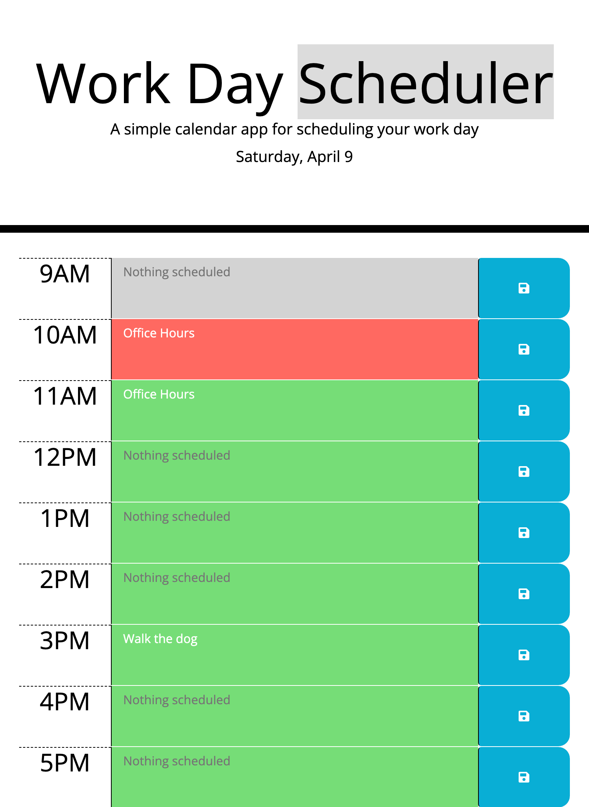

# Work Day Scheduler

## Purpose

The purpose of developing this application is to allow users to keep track of their daily events, using conditional formatting to display the events relative to current local time. 

As a developer, this project enhanced my knowledge of JQuery and JavaScript, how they can interact with one another, & utilizing similar functions and methods in different syntax. It further developed my understanding of local storage and the usefulness of incorporating different libraries. 

Further development is needed to allow users to clear their saved events in order to start with a blank slate the following day. 

### Given User Story

AS AN employee with a busy schedule
I WANT to add important events to a daily planner
SO THAT I can manage my time effectively

### This application has been developed to:
1. Display the current day & date at the top of the calendar, as well as time blocks for each hour of a 9am-5pm workday.
2. Color-code each time block conditionally based on whether it is in the past, present, or future for easy reference.
3. Allow users to click the event textarea, input event details, and save those details by clicking on the corresponding save button.
4. Persist event details across a page refresh.

## Application Details

This appplication performs best on a computer or tablet with a screen width of over 770px. 

Moment.js was initially used in the development of this application, but throughout this project has been switched over to Day.js. 

### JQuery Summary

- Day.js is used to retrieve the current date and hour in local time, storing those into separate variables.
- On document.ready, we retrieve event details from local storage using the "hour" key (paired with event description textContent) and match the "hour" key to the data-hour attribute on the h2.
- On page load, we also run the evaluateHour function, which formats the events conditionally by comparing the data-hour attribute on the h2 to the current hour (using Day.js).
- User may then input event details into the textareas.
- Click event listener on all button elements connects event target with the value of the sibling text area and sends a key/value pair to local storage 

### Main Files in Repository

- index.html
- style.css (given in starter code)
- script2.js (live JQuery file)
- script.js (same application written in plain JS / not actively linked in index.html / file used for practice translating JS to JQuery)

This application also utilizes the following APIs:

- Bootstrap
- JQuery
- Moment.js (from starter code)
- Day.js 

## Deployed Application

[(Link to deployed application)](https://emmazart.github.io/super-disco-rainbow/)

### Screenshot of deployed application:

The following screenshot demonstrates how the application looks on page load at 10am on Saturday, April 9th with some events saved in local storage.

